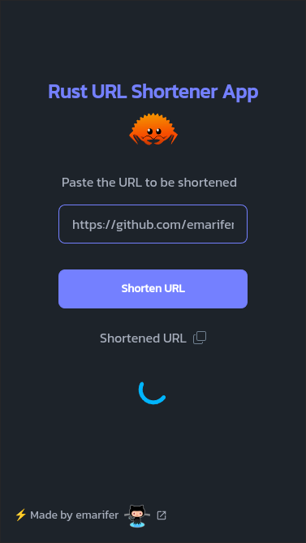
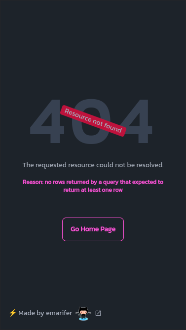
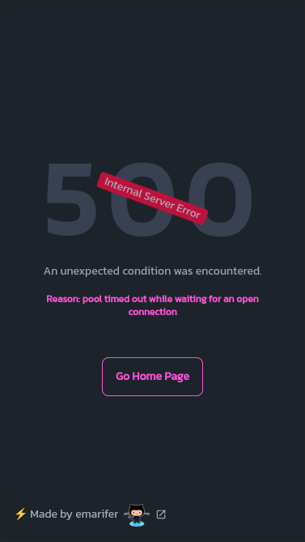

<div align="center">
  
<h1 align="center">Shortify - A Rust/Axum URL Shortener App</h1>


<hr />

<p style="margin-bottom: 8px;">

A Full Stack Url Shortener App using Rust's Axum framework + </>HTMX & Askama.

</p>
  
  

</div>

<hr />

## 🤔 What Stack have we used?

In the implementation of this application we have used the following technologies:

- ✅ **Bootstrapping**: [Rust programming language (v1.77.0)](https://www.rust-lang.org/)
- ✅ **Backend Framework**: [Axum v0.7.5 ](https://docs.rs/axum/latest/axum/)
- ✅ **Database**: [PostgreSQL](https://www.postgresql.org/)
- ✅ **Templating Language**: [Askama v0.12.1](https://docs.rs/askama/latest/askama/)
- ✅ **Styling**: [TailwindCSS + DaisyUI](https://tailwindcss.com)
- ✅ **Frontend interactivity**: [</>Htmx + _Hyperscript](https://htmx.org/)
  
<br />

>[!NOTE]
>***The use of [</>htmx](https://htmx.org/) allows behavior similar to that of a SPA, without page reloads when switching from one route to another or when making requests (via AJAX) to the backend. Likewise, the [_hyperscript](https://hyperscript.org/) library allows you to add some dynamic features to the frontend in a very easy way.***

---

## 🖼️ Screenshots:

<div align="center">

###### Home page showing button to copy shortened URL and loading indicator & error handling pages:

&nbsp;&nbsp;&nbsp;&nbsp;

</div>

---

## 👨‍🚀 Getting Started

#### How to build for production

Besides the obvious prerequisite of having Rust on your machine, you must have `cargo watch` installed for hot reloading when editing code.

Since we use the PostgreSQL database from a Docker container, it is necessary to have the latter also installed and execute this command in the project folder:

```
$ docker compose up -d
```

These other commands will also be useful to manage the database from its container:

```
$ docker start shortify-db # start container
$ docker stop shortify-db # stop container
$ docker exec -it shorturl-rs psql -U enrique -W shorturl # (pass: emarifer) access the database
```

You will also need to have the `sqlx` CLI installed (`sqlx-cli`, install it with the command `cargo install sqlx-cli`) to be able to do the migrations to the database. Run the following command in the `migrations` folder:

```
$ sqlx migrate run # sqlx migrate revert (to reverse the migration)
```

Build the binary file and run it with the command:

```
$ cargo build --release && ./target/release/shorturl-rs # Ctrl + C to stop the application
```

#### Build for development

If what you want is to edit the code, it will be more like activating hot reload:

```
$ cargo watch -x run -w src -w assets -w templates
```

> ⚠️ Since the `docker compose up -d` command creates a volume (as a hidden folder) in the project folder to store the data of the `Postgres` database and that folder requires system administrator permissions, the `cargo command watch -x run` would return an error. Therefore, we only "watch" the `src`, `assets` and `templates` folders.

If you also want to modify the CSS of the templates, it will be useful to activate the `watch` mode of Tailwindcss, executing the command inside the `tailwind` folder (you need to have `Node.js` installed):

```
$ npm run watch-css # minify for production: npm run build-css-prod
```

---

### Happy coding 😀!!